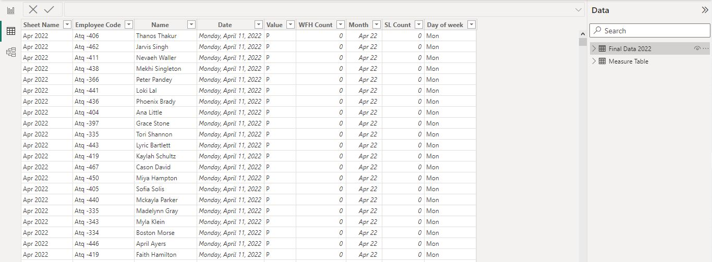
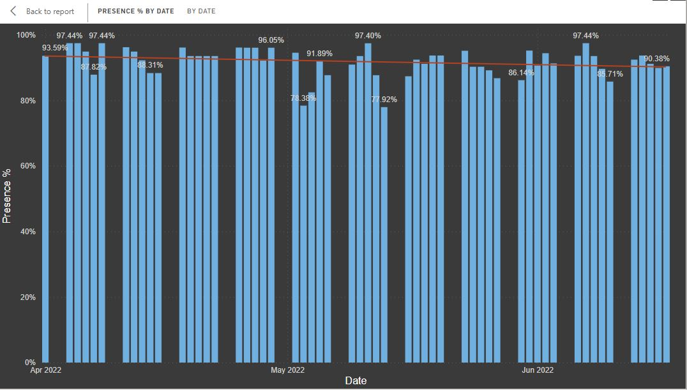
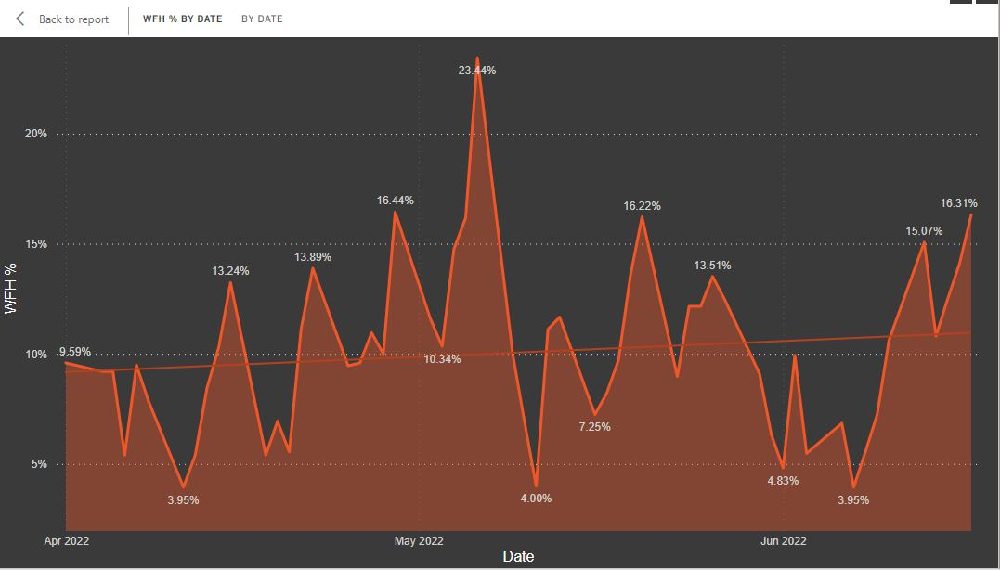
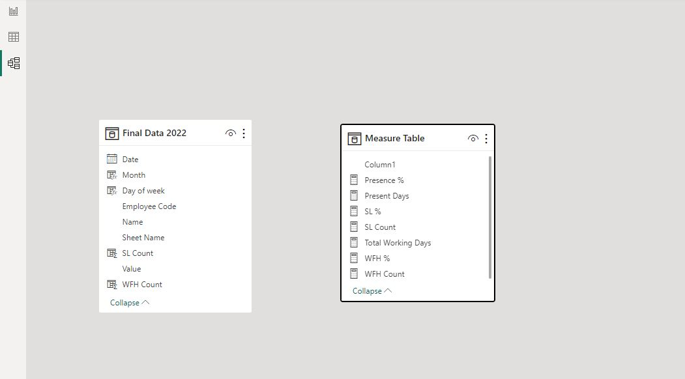
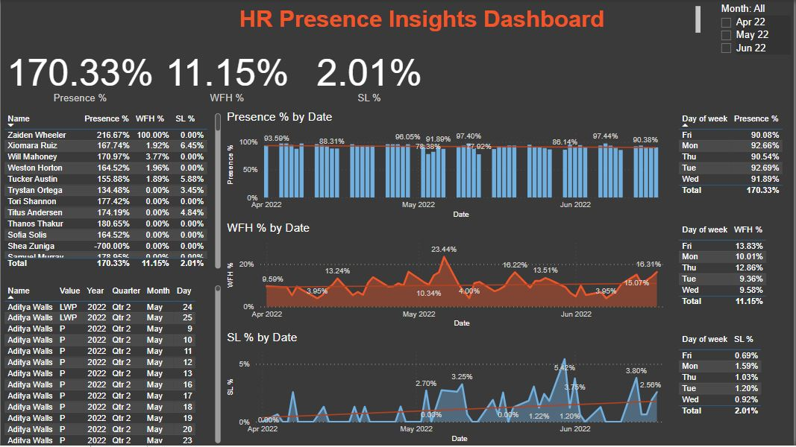

# HR-Presence-Insights-Dashboard-

---
## Introduction 
Human Resources (HR) has initiated a dashboard request aimed at acquiring comprehensive insights over a three-month period pertaining to employee presence at the workplace, work-from-home preferences, and sick leave patterns. This project serves as a pivotal initiative in equipping HR with the requisite data-driven tools to address critical inquiries and provide evidence-based responses. Leveraging the outcomes of this data analysis, HR can proactively strategize for future events, allowing for precise planning concerning specific days of the week and months when employees predominantly exhibit on-site attendance.

**_Disclaimer:_** All data sets do not represent any real institution, company or country, It is data for learning purposes on real life requests for any Data Analyst.

## Problem staement (HR Request)
1. What is the percentage of employees presence for the past three months?
2. What is the percentage of employees working from home for the last three months?
3. What is the percentage of employees who took Sick leave?
4. Be able to plan for future events where employees are mostly available at work.
5. Insights on the performance of individual employees presence.

## Skills/Concepts demonstrated
1. Excel data import to Power BI
2. Data cleansing using:
   - Power BI Query to transform data   
3. Matrix using DAX
   - to answer Client(HR) questions or query like presence, working from and sick leaves percetages
4. Measures
5. Visualization
   - Tables

   - Clustered column chats

   - Line charts

   - and Card

Lesson leanrt:
 - Grouping measures under one place.
 - Understanding how to calculate functions

## Model view

## Visualisation (Dashboard)

_You can interact with the report_ [here](https://app.powerbi.com/groups/me/reports/75ac8ff4-6759-4074-a868-9646f7f48c67/ReportSection?experience=power-bi)

:bulb: Answering HR request questions and future insights (day, week and month).
 - Total presence of employees in percentage.
 - Total percentage of employees working from home. 
 - Total percentage of employees taking sick leave.
 - Future insights on when is the best time to have employees at work.
 - Additional insights on employees performance in attendance.

## Conclusion 
In conclusion, the HR-Presence-Insights Dashboard project represents a significant step forward in providing Human Resources (HR) with data-driven tools to address critical workforce-related inquiries and to make evidence-based decisions. Over a three-month period, the dashboard has successfully delivered comprehensive insights into employee presence at the workplace, work-from-home preferences, and sick leave patterns.

The project addressed the HR request, answering key questions about employee presence, work-from-home trends, and sick leave percentages. Moreover, it equips HR with the ability to plan for future events by identifying days, weeks, and months when employees are most likely to be present at work. Additionally, it offers insights into individual employee attendance performance.

Throughout the project, several skills and concepts were demonstrated, including Excel data import to Power BI, data cleansing using Power BI Query, the use of DAX functions to create matrices and measures, and the effective visualization of data using tables, clustered column charts, line charts, and cards.

The model view provides a structured overview of the data model, enhancing the understanding of data relationships and calculations. The visualization in the form of the HR Analytics-themed dashboard offers an interactive experience for HR professionals to explore and gain insights.

As the report serves for learning purposes and does not represent any real institution, company, or country, it underscores the significance of data analysis and visualization skills in addressing real-life requests for any data analyst. Moving forward, the insights derived from this dashboard will empower HR to make informed decisions, optimize workforce management, and ensure a more efficient and productive workplace environment.

Thank you. 
